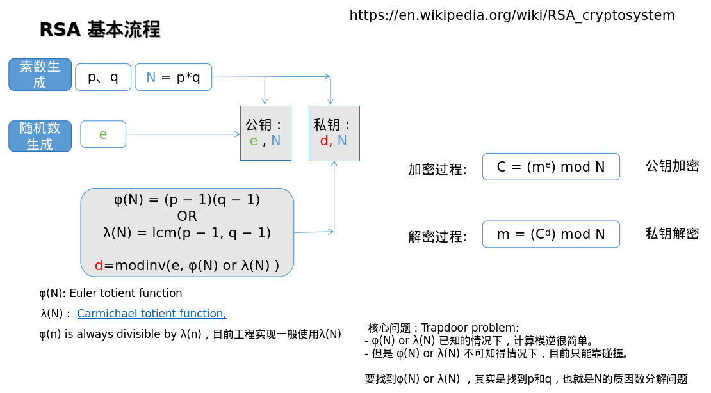

# A TOP level implementation

# RSA vs ECC

| 对比维度       | RSA                           | ECC                           |
|----------------|-------------------------------|-------------------------------|
| 公私钥构成     | 公钥为(e, N)，私钥为(d, N)   | 公钥是点 Q，私钥是整数 d，满足 Q = dG |
| 安全基础       | 基于大数分解的困难性         | 基于椭圆曲线离散对数问题（ECDLP） |
| 破解关键       | 对 N 做质数分解               | 解决 ECDLP 问题               |
| 破解难度       | 随着计算能力提升，难度降低，需增加密钥长度维持安全性 | 相同安全级别下，破解难度更大，密钥长度更短 |
| 破解复杂度     | 通用的数字筛法（GNFS）时间复杂度约为 O(e^(1.9n^(1/3))) | Pollard ρ 算法时间复杂度为 O(√n) |
| 破解方法       | 大数分解方法，如 GNFS 等     | Pollard ρ 算法等              |
